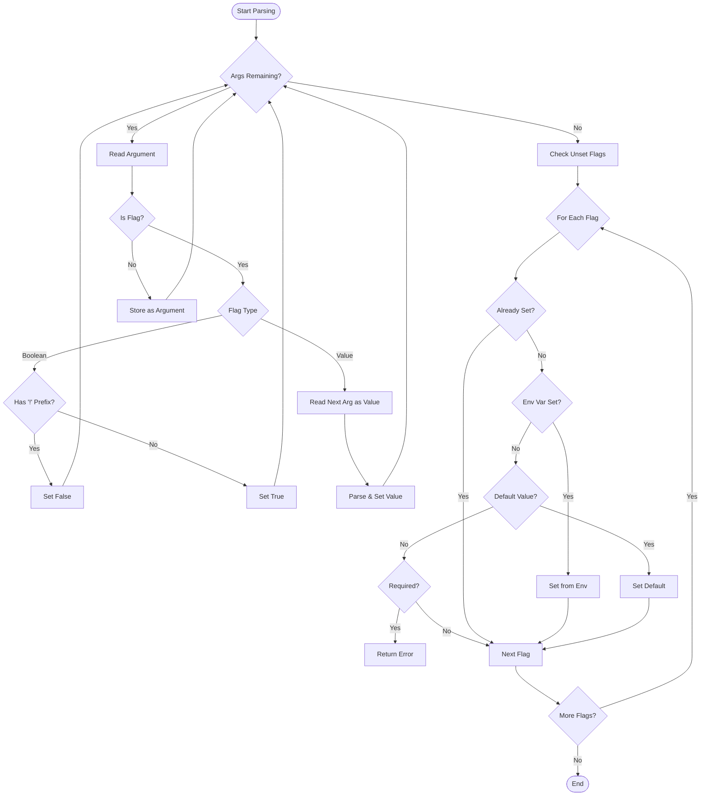

[](https://github.com/unsafe-risk/broccoli/blob/main/LICENSE)
[](https://github.com/unsafe-risk/broccoli/actions/workflows/go-test.yml)
[](https://pkg.go.dev/gopkg.eu.org/broccoli)

# Broccoli

Broccoli: A lightweight, struct-based [CLI](https://en.wikipedia.org/wiki/Command-line_interface) package for Go.

## Features

- **Struct-based Configuration**: Define your CLI interface using standard Go structs and tags.
- **Nested Subcommands**: Easily create deeply nested subcommands.
- **Flexible Flags**: Support for both long (`--flag`) and short (`-f`) flags.
- **Environment Variables**: Automatically bind flags to environment variables.
- **Defaults**: Robust support for default values.
- **Auto-generated Help**: Automatically generates comprehensive help messages.

## Usage

### Basic Example

```go
package main

import (
	"fmt"

	"gopkg.eu.org/broccoli"
)

type Config struct {
	_    struct{} `version:"0.0.1" command:"hello" about:"Test Application"`
	Name string   `flag:"name" alias:"n" required:"true" about:"Your name"`

	Sub *SubCommand `subcommand:"sub"`
}

type SubCommand struct {
	_    struct{} `command:"sub" longabout:"Test Sub Command"`
	Name string   `flag:"name" alias:"n" required:"true" about:"Your name"`
}

func main() {
	var cfg Config
	// BindOSArgs parses os.Args and populates the cfg struct.
	// It handles --help and exiting on error automatically.
	_ = broccoli.BindOSArgs(&cfg)

	if cfg.Sub != nil {
		fmt.Printf("Hello %s from sub command\n", cfg.Sub.Name)
		return
	}

	fmt.Printf("Hello %s from main command\n", cfg.Name)
}
```

**Output:**

```bash
$ hello --help
hello 0.0.1
Test Application

Usage:
        hello <COMMAND> [OPTIONS] --name <NAME> [ARGUMENTS]

Options:
        -n, --name     Your name  (required)
        -h, --help     Print this help message and exit

Commands:
        sub    Test Sub Command

$ hello --name World
Hello World from main command

$ hello sub --name World
Hello World from sub command
```

### Environment Variables

You can bind flags to environment variables using the `env` tag.

```go
type ServerConfig struct {
    Port int    `flag:"port" env:"PORT" default:"8080" about:"Port to listen on"`
    Host string `flag:"host" env:"HOST" default:"localhost" about:"Host to bind to"`
}
```

If the flag is not provided in the command line arguments, `broccoli` will check the `PORT` environment variable. If that is also missing, it will use the `default` value `8080`.

## Detailed Parsing Rules

### Flag Syntax

- **Long Flags**: start with `--` (e.g., `--config`).
- **Short Flags**: start with `-` (e.g., `-c`).

### Boolean Flags

- Presence of the flag sets it to `true`.
- To explicitly set a boolean flag to `false`, use the `!` prefix (e.g., `--!verbose`, `-!v`).

### Value Parsing

For non-boolean flags, the next argument is consumed as the value.

- **Integers**: Support various formats:
  - Hexadecimal: `0x...` or `0X...`
  - Binary: `0b...` or `0B...`
  - Octal: `0o...` or `0O...`
  - Decimal: Standard number
- **Slices**: Values are separated by commas (`,`).
  - Example: `--ports 8080,8081` parses into `[]int{8080, 8081}`.

### Precedence Priority

When determining the value of a field, `broccoli` follows this order:

1. **Command Line Argument**: Explicitly passed flags take highest priority.
2. **Environment Variable**: If defined via `env` tag.
3. **Default Value**: If defined via `default` tag.
4. **Required Check**: If none of the above exist and `required` is true, an error is returned.

### Parsing Flow



## Installation

```bash
go get -u gopkg.eu.org/broccoli
```
